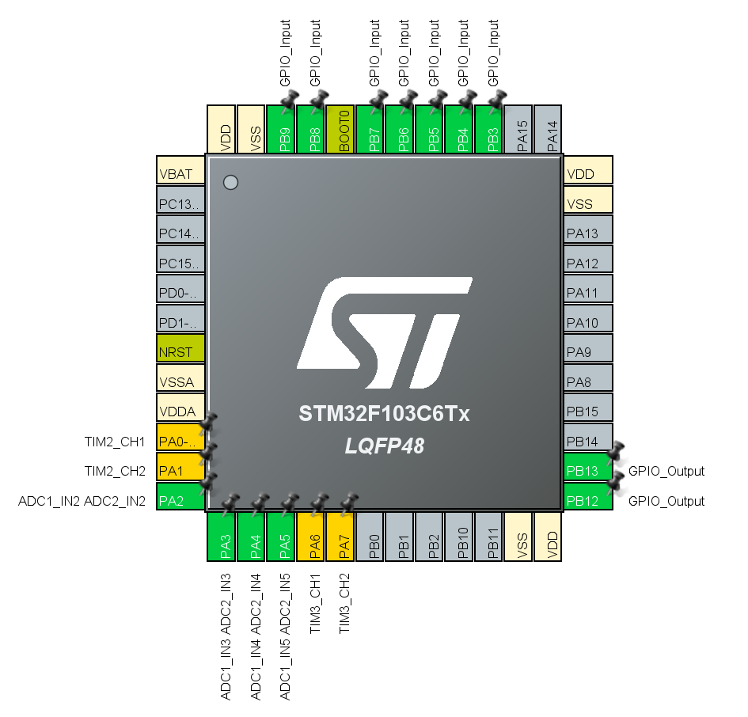

# 迈克尔逊干涉仪侧位移
	设计内容为使用 He-Ne 激光器搭建迈克尔逊干涉仪，在移动 M2 时，通过对干涉条纹明暗变化的次数计数来获得 M2 的精确位移

## 文件夹
- `.vscode` vscode配置文件
- `LOG` 制作过程中的简略日志记录
  - `Image` README中使用的图片
- `PCB` 电路板与原理图
  - `Libraries`原理图库和元件库
  - `22GD` 毕设使用电路板
  - `Test1` 首次测试使用电路板
- `Project` 单片机程序
  - `MDK` **MDK工程入口**
  - 其余文件夹均为程序库

## 引脚分配如下

